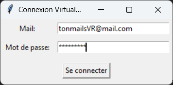
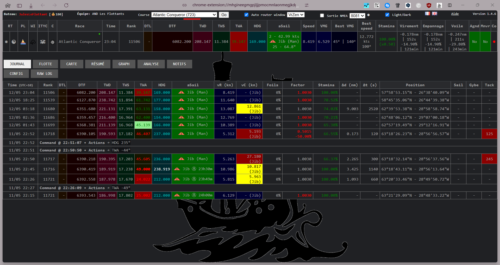
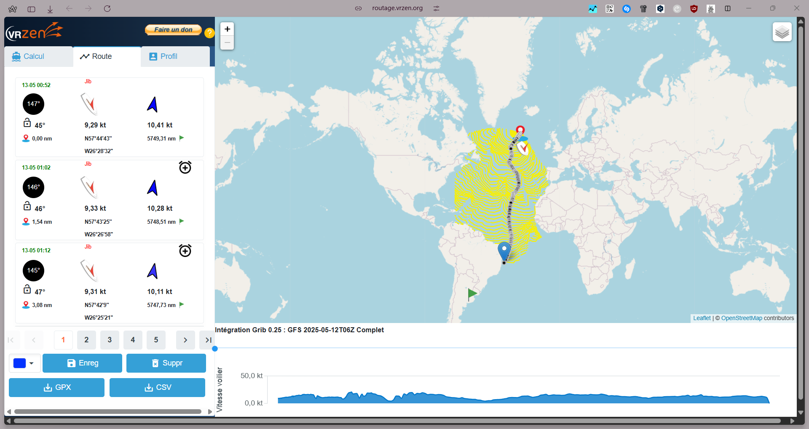
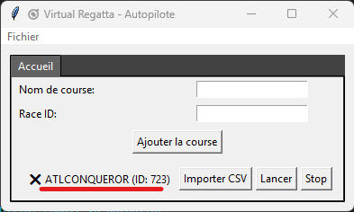

# ⛵ Virtual Regatta Autopilot

Bienvenue dans ton assistant de navigation autonome pour **Virtual Regatta Offshore** 🧭  
Un projet Python avec une interface graphique qui pilote automatiquement ton voilier à partir des fichiers générés par [VRZen](https://routage.vrzen.org/) et l'extension **VR Dashboard ITYC**.

---

## ⚙️ Installation

1. Va dans l’onglet **[Releases](https://github.com/Jude-A/virtual-regatta-autopilot/releases)** du dépôt.
2. Télécharge la dernière version `.zip` (exécutable prêt à l’emploi).
3. Extrais le dossier où tu veux.
4. Double-clique sur `VirtualRegattaAutopilot.exe`.

---

## 🔐 Connexion

À la première ouverture, l'app demande les **identifiants Virtual Regatta** :

Pas de stress : le mdp est **chiffré localement**, et utilisé uniquement pour l’appel API officiel.

---

## 🏁 Ajouter une course

Il faut ensuite renseigner les courses ou l'on souhaite l'autopilot manuellement :  
- Nom (nom apparaissant dans les .csv générés par VrZen, ex: VRZEN_**ATLCONQUEROR**_20250512T130559Z.csv)
- ID de la course (obligatoire)

> 📌 **Où trouver l’ID ?**  
> Active l’extension [VR Dashboard ITYC](https://chromewebstore.google.com/detail/vr-dashboard-ityc/mhgineegmgpjljjpmocmnlaonmegjkdg) et récupère l’ID dans le menu déroulant 👇

Ici, 723 !

> 📌 **Où trouver le Nom ?**
> Par le biais de cette même extension et d'un routeur proposé VrZen
> 

---

## 📥 Importer un fichier CSV (via VRZen)

1. Va sur [VRZen](https://routage.vrzen.org), choisis ta route et exporte-la en **CSV**.
2. Clique sur “Importer CSV” dans l'interface de ton autopilote.

---

## ▶️ Lancer l’autopilote

- Clique sur “Lancer” pour démarrer le suivi automatique de la route.
- Le programme enverra les **caps** et les **voiles** aux moments définis dans le CSV.

🖥️ Tu peux suivre les actions envoyées en temps réel via les logs :

---

## 🧠 Ce que fait le projet (techniquement)

- Authentification via API officielle VR
- Interface Tkinter avec onglets multi-courses
- Multiprocessing pour gérer plusieurs bateaux en parallèle
- Lecture et parsing intelligent des CSV
- Gestion des logs par course
- Configuration portable (.exe avec PyInstaller)

---

## 🚧 Prochaines évolutions

- Calculateur d’**isochrones interne** (fini les CSV !)
- Visualisation des routes
- Planification sur plusieurs jours
- Intégration météo ?

---

## 🛡️ Note

Ce projet est **non affilié** à Virtual Regatta.  
Il s'agit d'un projet personnel open-source à des fins d'automatisation raisonnée.

---

## ❤️ Contribuer

Tu veux améliorer le projet, corriger un bug ou ajouter une fonction ? Fork le repo, crée une branche et propose un `pull request` !

